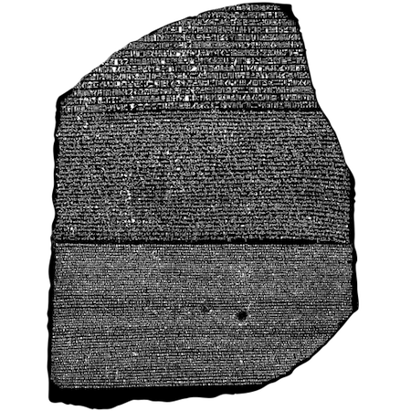

# Functional Rosetta Stone

[](https://github.com/jabrena/functional-rosetta-stone/actions/workflows/maven.yml)



## Goal

A repository to review the main concepts about Functional Programming with Java.

## How to build the project in local?

```bash
sdk env install
./mvnw clean test -DexcludedGroups=performance,endtoend
./mvnw clean test -DexcludedGroups=performance,endtoend -pl training
./mvnw clean test -DexcludedGroups=performance,endtoend -Dtest=AgeProblemExampleTest -pl training
./mvnw clean test -Dgroups=performance
./mvnw clean test -Dgroups=endtoend

./mvnw versions:display-property-updates
./mvnw versions:display-dependency-updates
./mvnw versions:display-plugin-updates
./mvnw dependency:tree -pl problems 
```

## Functional programming features in Java

- [x] [Lambda Expressions](https://openjdk.org/jeps/126) (Functional interfaces, Functions, Supplier, Consumer & Predicates)
- [x] [Optional](https://openjdk.org/jeps/401)
- [x] [Stream API](https://openjdk.org/jeps/107) & [Gatherers](https://openjdk.org/jeps/461)
- [x] [CompletableFuture](https://openjdk.org/jeps/266) & [Structural Concurrency](https://openjdk.org/jeps/453)
- [x] [Immutable Lists](https://openjdk.org/jeps/269)
- [x] [Sealed Classes](https://openjdk.org/jeps/409)
- [x] [Pattern Matching for Switch](https://openjdk.org/jeps/441)
- [x] [Records](https://openjdk.org/jeps/395) & [Record Patterns](https://openjdk.org/jeps/440)

## How to run the presentation in local?

```bash
jwebserver -p 9000 -d "$(pwd)/docs/"
```

## Performance

Using the [jmh-results.json](https://github.com/jabrena/functional-rosetta-stone/blob/master/docs/jmh-results.json) 
you can review the performance results: 

- [https://jmh.morethan.io/](http://jmh.morethan.io/?source=https://raw.githubusercontent.com/jabrena/functional-rosetta-stone/master/docs/jmh-results.json)
- https://nilskp.github.io/jmh-charts/
- https://github.com/akarnokd/jmh-compare-gui

## References

- https://github.com/jabrena/latency-problems
- https://github.com/forax/loom-fiber
- https://cr.openjdk.org/~vklang/Gatherers.html
- https://github.com/forax/we_are_all_to_gather
- https://www.infoq.com/articles/data-oriented-programming-java/
- https://inside.java/2024/05/23/dop-v1-1-introduction/
- https://inside.java/2024/05/27/dop-v1-1-immutable-transparent-data/
- https://inside.java/2024/05/29/dop-v1-1-model-data/
