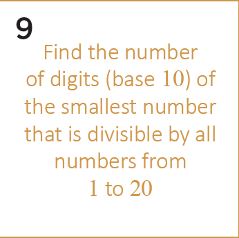
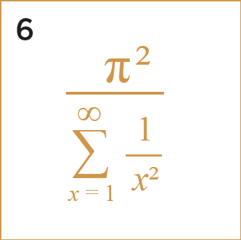
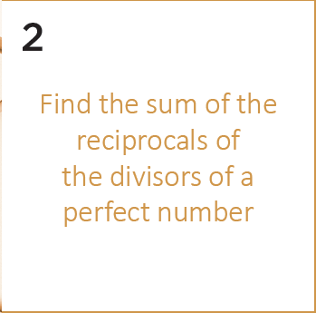
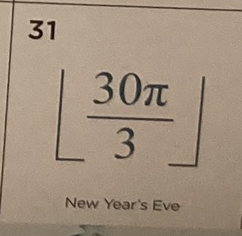
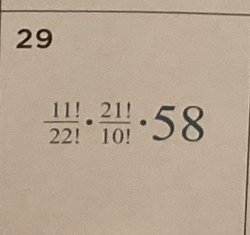
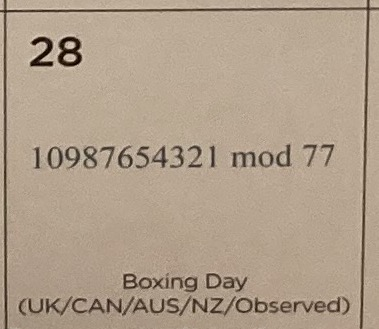
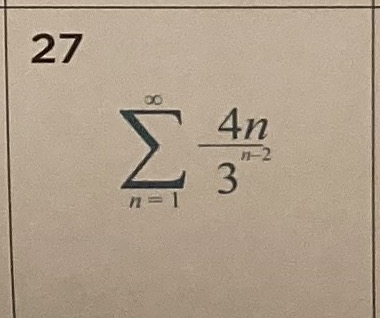
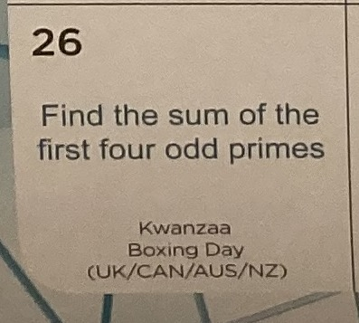
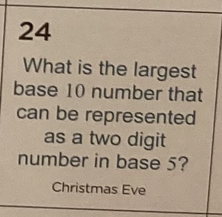

# Daily_Epsilon

In this folder, I will try to solve Math problems from:

- https://twitter.com/Daily_Epsilon

## 2022/01/09



```
jbang Problem20220109.java
```

## 2022/01/06



```
jbang Problem20220106.java
```

## 2022/01/02



```
jbang Problem20220102.java
```

## 2022/01/01


```
jbang Problem20220101.java
```

---

## 2021/12/31



```
jbang Problem20211231.java
```

## 2021/12/29



```
jbang Problem20211229.java
```

## 2021/12/28



```
jbang Problem20211228.java
```

## 2021/12/27



```
jbang Problem20211227.java
```

## 2021/12/26



```
jbang Problem20211226.java
```

## 2021/12/24



```
jbang Problem20211224.java
```

## How to install Jbang?

```
sdk install jbang
```

## Testing Jbang

```
jbang HelloWorld.java
```
